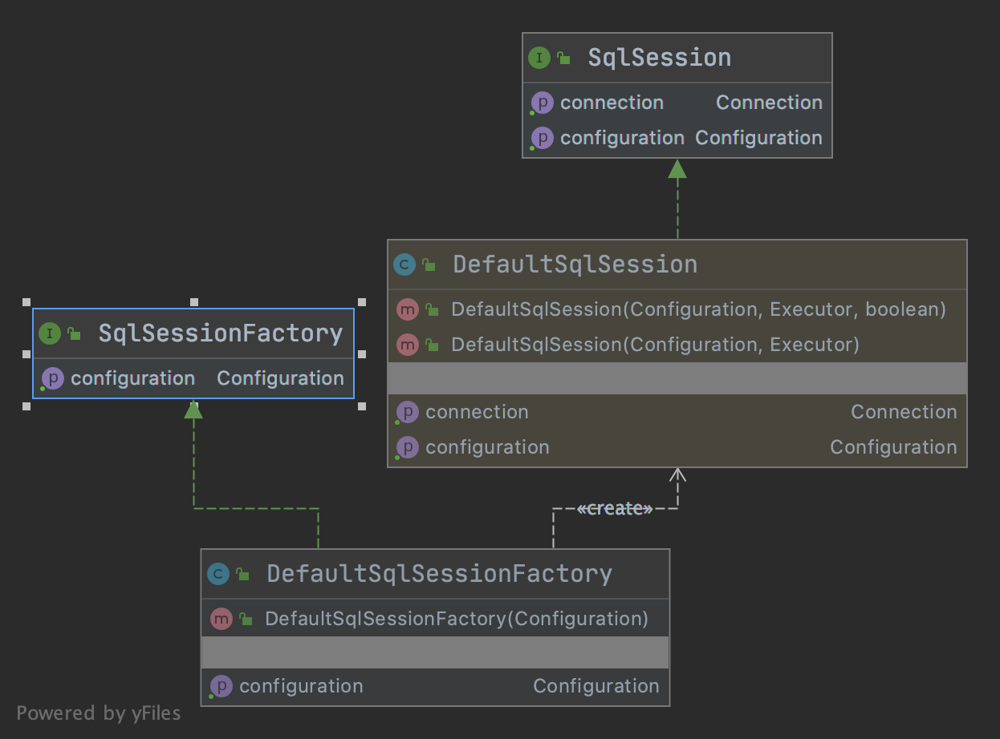
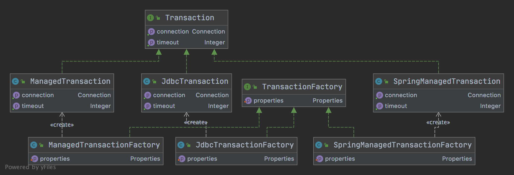
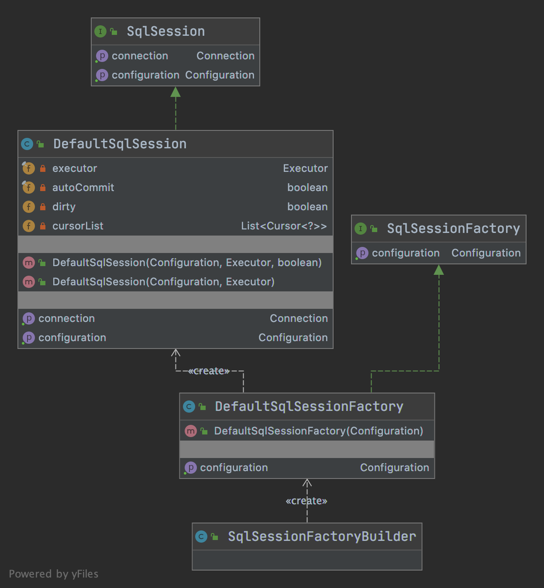
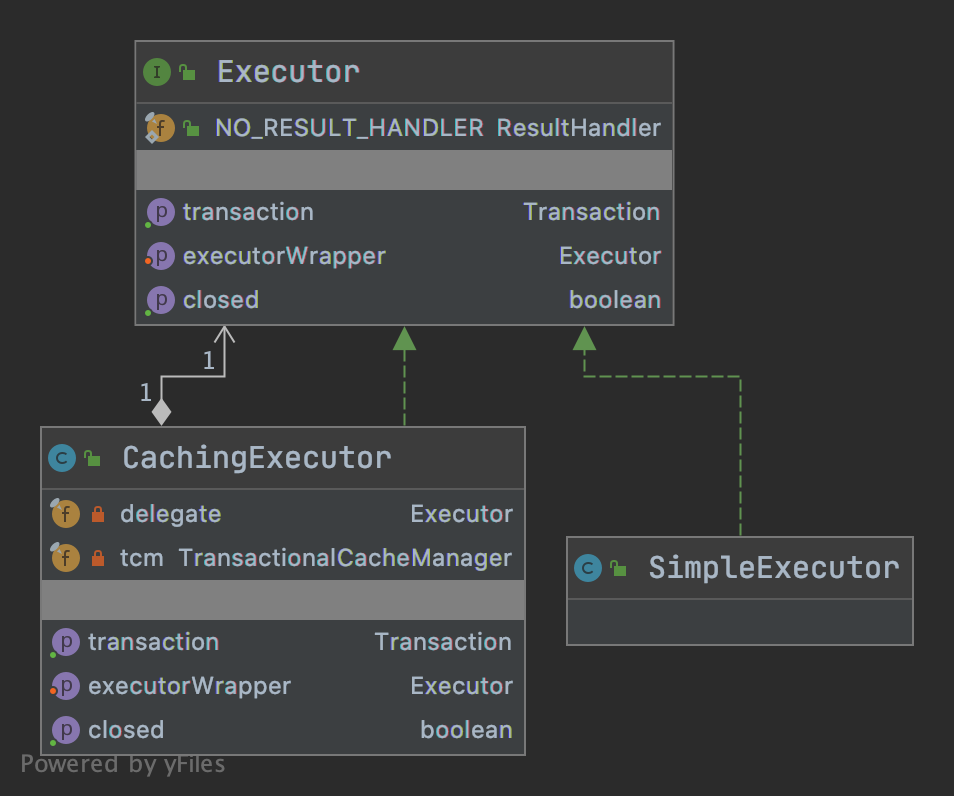

# MyBatis中的设计模式

## 创建型

### FactoryMethod(工厂方法)
```java
import org.apache.ibatis.session.defaults.DefaultSqlSessionFactory;
import java.sql.Connection;
/**
 * {@linkplain DefaultSqlSessionFactory#openSession()} 
 * {@linkplain org.apache.ibatis.transaction.jdbc.JdbcTransactionFactory#newTransaction( Connection)}  
 * {@linkplain org.apache.ibatis.transaction.managed.ManagedTransactionFactory#newTransaction( Connection)}  
 */
public class Test{
}
```

| SqlSessionFactory | TransactionFactory |
| :--------: | :--------: |
|  |  |

### 构建者(Builder)

```java
import org.apache.ibatis.mapping.MappedStatement;
import org.apache.ibatis.session.Configuration;
/**
 * {@linkplain org.apache.ibatis.session.SqlSessionFactoryBuilder}
 * {@linkplain MappedStatement.Builder}
 */
public class Test{
}
```

| SqlSessionFactoryBuilder |
| :--------: |
|  |

## 结构型

### Decorator(装饰者)

```java
import org.apache.ibatis.executor.Executor;
/**
 * {@linkplain org.apache.ibatis.executor.CachingExecutor#CachingExecutor( Executor)}
 * 以及Cache这个包下面的decorators所有都是装饰器模式!!!
 * {@linkplain org.apache.ibatis.cache.decorators}
 */
public class Test{
}
```

| CachingExecutor |
| :--------: |
|  |

### Proxy(代理模式)

```java
/**
 * {@linkplain org.apache.ibatis.binding.MapperProxy}
 */
public class Test{
}
```